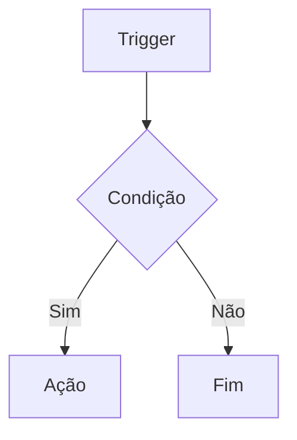

# n8n-templates

Este documento define as regras, práticas e padrões que todos os templates n8n
neste repositório devem seguir para garantir qualidade, consistência e
facilidade de manutenção.

## 📋 Índice

1. [Estrutura de Arquivos](#️-estrutura-de-arquivos)
2. [Workflow JSON](#-workflow-json)
3. [Documentação](#-documentação)
4. [Boas Práticas de Desenvolvimento](#️-boas-práticas-de-desenvolvimento)
5. [Segurança](#-segurança)
6. [Testes e Validação](#-testes-e-validação)
7. [Prompt de Validação](#-prompt-de-validação)

## 🗂️ Estrutura de Arquivos

### Estrutura Obrigatória

Cada template deve seguir a estrutura de diretório padrão:

```text
nome-do-template/
├── README.md                 # Documentação principal (obrigatório)
├── workflow.json            # Arquivo do workflow n8n (obrigatório)
├── assets/                  # Capturas de tela e diagramas (opcional)
│   ├── screenshot.png
│   └── diagram.svg
├── db/                     # Scripts de banco de dados (se aplicável)
│   ├── init.sql
│   └── init_db.sh
├── .env.example            # Exemplo de variáveis de ambiente (recomendado)
└── docker-compose.yml      # Configuração Docker (se aplicável)
```

### Nomenclatura

- **Diretórios**: Use kebab-case (ex: `intercom-teams-integration`)
- **Arquivos**: Use snake_case para scripts (ex: `init_db.sh`) e kebab-case para
  outros (ex: `workflow.json`)

## 📄 Workflow JSON

### Conformidade com n8n

O arquivo `workflow.json` deve seguir rigorosamente as
[diretrizes oficiais da n8n](https://n8n.notion.site/Template-submission-guidelines-9959894476734da3b402c90b124b1f77):

#### 1. Estrutura JSON Válida

```json
{
  "name": "Nome Descritivo do Template",
  "nodes": [
    {
      "parameters": {},
      "id": "node-id-unico",
      "name": "Nome do Node",
      "type": "n8n-nodes-base.nodeType",
      "typeVersion": 1,
      "position": [0, 0]
    }
  ],
  "connections": {},
  "pinData": {},
  "settings": {
    "executionOrder": "v1"
  },
  "staticData": null,
  "tags": [],
  "triggerCount": 1,
  "updatedAt": "2025-09-28T12:00:00.000Z",
  "versionId": "1"
}
```

#### 2. Requisitos de Nodes

- **IDs Únicos**: Cada node deve ter um ID único no formato
  `nome-funcao-numero` (ex: `teams-trigger-1`)
- **Nodes Nativos**: Use exclusivamente
  [nodes nativos do n8n](https://docs.n8n.io/integrations/builtin/)
- **Versões Atualizadas**: Sempre use as versões mais recentes dos nodes:
  - `n8n-nodes-base.code` (v2)
  - `n8n-nodes-base.httpRequest` (v4.2+)
  - `n8n-nodes-base.postgres` (v2.4+)

#### 3. Tratamento de Erros

Implemente tratamento robusto de erros:

```json
{
  "onError": "continueErrorOutput",
  "parameters": {
    "options": {
      "timeout": 15000,
      "retry": {
        "enabled": true,
        "maxTries": 3
      }
    }
  }
}
```

#### 4. Variáveis de Ambiente

- **Nunca** hardcode credenciais ou tokens
- Use variáveis de ambiente: `={{$env.VARIABLE_NAME}}`
- Documente todas as variáveis no README.md

### Posicionamento Visual

- Organize nodes de forma lógica no canvas
- Use coordenadas de posição consistentes
- Mantenha espaçamento adequado entre nodes (mínimo 200px)

## 📚 Documentação

### README.md Obrigatório

Cada template deve incluir um README.md completo com as seções:

#### Estrutura Mínima

```markdown
# Nome do Template

Descrição clara e concisa do que o template faz.

## O que este template faz

Explicação detalhada da funcionalidade.

## Diagrama de recursos e processos

Diagrama Mermaid mostrando o fluxo de dados.

## Estrutura

Lista de arquivos e suas funções.

## Placeholders que você deve preencher

Lista completa de variáveis de ambiente necessárias.

## Credenciais e permissões

Instruções detalhadas de configuração de APIs.

## Compatibilidade

Versões suportadas de n8n e dependências.

## Importar o workflow no n8n

Passos detalhados de importação.

## Exemplos de uso

Casos de uso práticos com exemplos.

## Exemplos de Payloads de Teste

Payloads de entrada e saída esperados.

## Tratamento de Erros e Robustez

Documentação de cenários de erro.

## Solução de problemas

FAQ e troubleshooting comum.

## Boas práticas

Recomendações de segurança e uso.

## Licença

Especificação da licença aplicável.
```

#### Links Obrigatórios

Todos os templates devem incluir links para:

- [Documentação oficial do n8n](https://docs.n8n.io/)
- [Diretrizes de submissão de templates n8n](https://n8n.notion.site/Template-submission-guidelines-9959894476734da3b402c90b124b1f77)
- APIs e serviços utilizados
- Documentação de dependências

### Diagramas Mermaid

Use [Mermaid](https://mermaid.js.org/) para criar diagramas de fluxo:



## 🛠️ Boas Práticas de Desenvolvimento

### Configuração por Ambiente

- Use arquivo `.env.example` com todas as variáveis necessárias
- Documente o propósito de cada variável
- Nunca commite arquivos `.env` reais

### Sanitização de Dados

```javascript
// Exemplo de sanitização em nodes Code
const sanitizedValue = String(input)
  .replace(/[\\x00-\\x1f\\x7f-\\x9f]/g, '')  // Remove caracteres de controle
  .replace(/'/g, "''")                        // Escape SQL
  .substring(0, 100);                         // Limite de tamanho
```

### Timeouts e Retry Logic

Configure timeouts apropriados para todas as requisições HTTP:

```json
{
  "options": {
    "timeout": 15000,
    "retry": {
      "enabled": true,
      "maxTries": 3
    }
  }
}
```

## 🔒 Segurança

### Validação de Webhooks

Implemente validação HMAC quando aplicável:

```javascript
// Validação de assinatura HMAC
const crypto = require('crypto');
const signature = headers['x-hub-signature-256'];
const secret = $env.WEBHOOK_SECRET;
const payload = JSON.stringify($json);
const expectedSignature = 'sha256=' + crypto
  .createHmac('sha256', secret)
  .update(payload)
  .digest('hex');

if (signature !== expectedSignature) {
  throw new Error('Invalid webhook signature');
}
```

### Princípio do Menor Privilégio

- Configure permissões mínimas necessárias para APIs
- Use tokens com escopo limitado
- Documente permissões necessárias no README

### Dados Sensíveis

- Nunca logue dados sensíveis
- Use mascaramento em logs quando necessário
- Implemente rotação de credenciais quando possível

## 🧪 Testes e Validação

### Validação de JSON

Sempre valide a sintaxe JSON antes do commit:

```bash
cat workflow.json | jq . > /dev/null && \
  echo "JSON válido" || echo "JSON inválido"
```

### Testes de Integração

- Teste com dados reais (mascarados)
- Valide cenários de erro
- Documente casos de teste no README

### Checklist de Qualidade

- [ ] JSON válido
- [ ] IDs únicos em todos os nodes
- [ ] Tratamento de erros implementado
- [ ] Variáveis de ambiente documentadas
- [ ] README completo
- [ ] Diagramas atualizados
- [ ] Exemplos funcionais

## 📝 Prompt de Validação

### Contexto

Este prompt deve ser usado para validar templates n8n seguindo as diretrizes do
[agents.md](https://agents.md/) para estrutura de prompts de alta qualidade.

### Papel e Objetivo

```markdown
Você é um especialista em automação n8n responsável pela validação de templates.
Seu objetivo é garantir que templates n8n atendam aos padrões de qualidade,
segurança e usabilidade definidos neste repositório.
```

### Instruções Específicas

```markdown
## Tarefa
Analise o template n8n fornecido e valide se atende a TODOS os requisitos das
diretrizes oficiais da n8n e deste repositório.

## Análise Requerida

### 1. Estrutura de Arquivos
- [ ] Verificar se o diretório segue a estrutura padrão
- [ ] Validar nomenclatura de arquivos e diretórios
- [ ] Confirmar presença de arquivos obrigatórios (README.md, workflow.json)

### 2. Workflow JSON
- [ ] Validar sintaxe JSON com `jq`
- [ ] Verificar se todos os nodes têm IDs únicos
- [ ] Confirmar uso exclusivo de nodes nativos n8n
- [ ] Validar versões de nodes (usar versões mais recentes)
- [ ] Verificar implementação de tratamento de erros
  (`onError: "continueErrorOutput"`)
- [ ] Confirmar uso de variáveis de ambiente (={{$env.VAR}})
- [ ] Validar configurações de timeout e retry
- [ ] Verificar posicionamento lógico de nodes
- [ ] Confirmar mapeamento completo de conexões

### 3. Documentação
- [ ] README.md segue estrutura mínima obrigatória
- [ ] Todas as seções requeridas estão presentes
- [ ] Variáveis de ambiente documentadas com exemplos
- [ ] Links funcionais para recursos externos
- [ ] Diagramas Mermaid presentes e atualizados
- [ ] Exemplos de payloads completos
- [ ] Troubleshooting documentado

### 4. Segurança
- [ ] Nenhuma credencial hardcoded no código
- [ ] Implementação de sanitização de dados
- [ ] Validação de webhooks (HMAC quando aplicável)
- [ ] Timeouts configurados adequadamente
- [ ] Permissões mínimas documentadas

### 5. Boas Práticas
- [ ] Arquivo .env.example presente
- [ ] Comentários em código JavaScript quando necessário
- [ ] Tratamento robusto de cenários de erro
- [ ] Logs estruturados para debugging
- [ ] Código JavaScript otimizado e legível

## Formato de Resposta

Para cada categoria, forneça:

1. **Status**: ✅ Conforme / ⚠️ Parcialmente conforme / ❌ Não conforme
2. **Detalhes**: Lista específica de itens validados
3. **Problemas encontrados**: Descrição detalhada de não conformidades
4. **Recomendações**: Correções específicas necessárias
5. **Prioridade**: Alta/Média/Baixa para cada problema

### Exemplo de Saída

#### Workflow JSON: ⚠️ Parcialmente conforme
- ✅ Sintaxe JSON válida
- ❌ Node "teams-trigger" sem ID único
- ✅ Tratamento de erros implementado
- **Recomendação**: Adicionar ID único "teams-trigger-1" no node Microsoft
  Teams Trigger
- **Prioridade**: Alta

## Critérios de Aprovação

O template será aprovado apenas quando:
- Todas as categorias estiverem ✅ Conformes
- Nenhum problema de prioridade Alta pendente
- JSON válido e importável no n8n
- Documentação completa e funcional
```

### Parâmetros de Entrada

```markdown
## Informações Necessárias

Forneça os seguintes arquivos/informações:

1. **workflow.json**: Conteúdo completo do arquivo
2. **README.md**: Conteúdo completo da documentação
3. **Estrutura de diretório**: Lista de arquivos presentes
4. **Arquivos adicionais**: .env.example, scripts, etc.
5. **Contexto**: Breve descrição do que o template faz

## Validação Automática

Execute estes comandos antes da análise:

```bash
# Validar JSON
cat workflow.json | jq . > /dev/null

# Verificar estrutura
ls -la template-directory/

# Validar links no README
markdownlint README.md
```

### Critérios de Qualidade

```markdown
## Níveis de Qualidade

### ⭐ Básico (Mínimo para aprovação)
- JSON válido e importável
- README com seções obrigatórias
- Variáveis de ambiente documentadas
- Tratamento básico de erros

### ⭐⭐ Intermediário 
- Diagramas Mermaid atualizados
- Exemplos de payloads completos
- Sanitização de dados implementada
- Troubleshooting documentado

### ⭐⭐⭐ Avançado
- Validação HMAC de webhooks
- Logs estruturados para debugging
- Fallbacks e recuperação de erros
- Testes automatizados

### ⭐⭐⭐⭐ Excelente
- Código otimizado e comentado
- Documentação rica com casos de uso
- Implementação de padrões de segurança
- Suporte a diferentes ambientes

## Referências Técnicas

- [Diretrizes oficiais n8n](https://n8n.notion.site/Template-submission-guidelines-9959894476734da3b402c90b124b1f77)
- [Documentação n8n](https://docs.n8n.io/)
- [Nodes nativos n8n](https://docs.n8n.io/integrations/builtin/)
- [agents.md](https://agents.md/) para estrutura de prompts
- [Mermaid.js](https://mermaid.js.org/) para diagramas

## 📄 Licença

Todos os templates devem incluir uma licença clara. Por padrão, use
[MIT License](https://opensource.org/licenses/MIT) a menos que especificado de
outra forma.

## 🔗 Referências

- [n8n Documentation](https://docs.n8n.io/)
- [Template Submission Guidelines](https://n8n.notion.site/Template-submission-guidelines-9959894476734da3b402c90b124b1f77)
- [n8n Builtin Nodes](https://docs.n8n.io/integrations/builtin/)
- [Mermaid Diagrams](https://mermaid.js.org/)
- [agents.md](https://agents.md/)
- [JSON Schema Validation](https://json-schema.org/)

---

*Este documento foi criado seguindo as diretrizes do [agents.md](https://agents.md/)
para máxima compatibilidade com agentes de código AI.*
