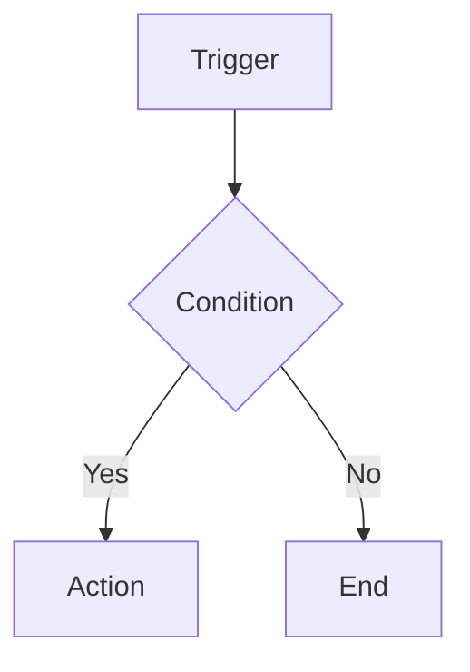

# n8n-templates

This document defines the rules, practices and standards that all n8n templates
in this repository must follow to ensure quality, consistency and ease of
maintenance.

⏳ Estimated reading time: 8 min

## 📋 Table of Contents

1. [File Structure](#️-file-structure)
2. [Workflow JSON](#-workflow-json)
3. [Documentation](#-documentation)
4. [Development Best Practices](#️-development-best-practices)
5. [Security](#-security)
6. [Testing and Validation](#-testing-and-validation)
7. [Validation Prompt](#-validation-prompt)

## 🗂️ File Structure

### Required Structure

Each template must follow the standard directory structure:

```text
template-name/
├── README.md                 # Main documentation (required)
├── workflow.json            # n8n workflow file (required)
├── assets/                  # Screenshots and diagrams (optional)
│   ├── screenshot.png
│   └── diagram.svg
├── db/                     # Database scripts (if applicable)
│   ├── init.sql
│   └── init_db.sh
├── .env.example            # Environment variables example (recommended)
└── docker-compose.yml      # Docker configuration (if applicable)
```

### Naming Convention

- **Directories**: Use kebab-case (ex: `intercom-teams-integration`)
- **Files**: Use snake_case for scripts (ex: `init_db.sh`) and kebab-case for
  others (ex: `workflow.json`)

## 📄 Workflow JSON

### n8n Compliance

The `workflow.json` file must strictly follow the
[official n8n guidelines](https://n8n.notion.site/Template-submission-guidelines-9959894476734da3b402c90b124b1f77):

#### 1. Valid JSON Structure

```json
{
  "name": "Descriptive Template Name",
  "nodes": [
    {
      "parameters": {},
      "id": "unique-node-id",
      "name": "Node Name",
      "type": "n8n-nodes-base.nodeType",
      "typeVersion": 1,
      "position": [0, 0]
    }
  ],
  "connections": {},
  "pinData": {},
  "settings": {
    "executionOrder": "v1"
  },
  "staticData": null,
  "tags": [],
  "triggerCount": 1,
  "updatedAt": "2025-09-28T12:00:00.000Z",
  "versionId": "1"
}
```

#### 2. Node Requirements

- **Unique IDs**: Each node must have a unique ID in the format
  `name-function-number` (ex: `teams-trigger-1`)
- **Native Nodes**: Use exclusively
  [native n8n nodes](https://docs.n8n.io/integrations/builtin/)
- **Updated Versions**: Always use the latest node versions:
  - `n8n-nodes-base.code` (v2)
  - `n8n-nodes-base.httpRequest` (v4.2+)
  - `n8n-nodes-base.postgres` (v2.4+)

#### 3. Error Handling

Implement robust error handling:

```json
{
  "onError": "continueErrorOutput",
  "parameters": {
    "options": {
      "timeout": 15000,
      "retry": {
        "enabled": true,
        "maxTries": 3
      }
    }
  }
}
```

#### 4. Environment Variables

- **Never** hardcode credentials or tokens
- Use environment variables: `={{$env.VARIABLE_NAME}}`
- Document all variables in README.md

### Visual Positioning

- Organize nodes logically on canvas
- Use consistent position coordinates
- Maintain adequate spacing between nodes (minimum 200px)

## 📚 Documentation

### Required README.md

Each template must include a complete README.md with the sections:

#### Minimum Structure

```markdown
# Template Name

Clear and concise description of what the template does.

## What this template does

Detailed explanation of functionality.

## Resources and processes diagram

Mermaid diagram showing data flow.

## Structure

List of files and their functions.

## Placeholders you must fill

Complete list of required environment variables.

## Credentials and permissions

Detailed API configuration instructions.

## Compatibility

Supported n8n versions and dependencies.

## Import workflow into n8n

Detailed import steps.

## Usage examples

Practical use cases with examples.

## Test Payload Examples

Expected input and output payloads.

## Error Handling and Robustness

Error scenario documentation.

## Troubleshooting

Common FAQ and troubleshooting.

## Best practices

Security and usage recommendations.

## License

Applicable license specification.
```

#### Required Links

All templates must include links to:

- [Official n8n Documentation](https://docs.n8n.io/)
- [n8n Template Submission Guidelines](https://n8n.notion.site/Template-submission-guidelines-9959894476734da3b402c90b124b1f77)
- Used APIs and services
- Dependencies documentation

### Mermaid Diagrams

Use [Mermaid](https://mermaid.js.org/) to create flow diagrams:



### Markdownlint

The README.md file must be validated with markdownlint to ensure compliance
with documentation quality standards:

```bash
# Install markdownlint (if needed)
npm install -g markdownlint-cli

# Validate file using repository configuration
markdownlint README.md
```

**Configuration**: The repository includes `.markdownlint.json` with rules
optimized for technical templates (line limit: 120 characters,
allows `` tags).

## 🛠️ Development Best Practices

### Environment Configuration

- Use `.env.example` file with all necessary variables
- Document the purpose of each variable
- Never commit real `.env` files

### Data Sanitization

```javascript
// Example of sanitization in Code nodes
const sanitizedValue = String(input)
  .replace(/[\\x00-\\x1f\\x7f-\\x9f]/g, '')  // Remove control characters
  .replace(/'/g, "''")                        // SQL escape
  .substring(0, 100);                         // Size limit
```

### Timeouts and Retry Logic

Configure appropriate timeouts for all HTTP requests:

```json
{
  "options": {
    "timeout": 15000,
    "retry": {
      "enabled": true,
      "maxTries": 3
    }
  }
}
```

## 🔒 Security

### Webhook Validation

Implement HMAC validation when applicable:

```javascript
// HMAC signature validation
const crypto = require('crypto');
const signature = headers['x-hub-signature-256'];
const secret = $env.WEBHOOK_SECRET;
const payload = JSON.stringify($json);
const expectedSignature = 'sha256=' + crypto
  .createHmac('sha256', secret)
  .update(payload)
  .digest('hex');

if (signature !== expectedSignature) {
  throw new Error('Invalid webhook signature');
}
```

### Principle of Least Privilege

- Configure minimum necessary API permissions
- Use tokens with limited scope
- Document required permissions in README

### Sensitive Data

- Never log sensitive data
- Use masking in logs when necessary
- Implement credential rotation when possible

## 🧪 Testing and Validation

### JSON Validation

Always validate JSON syntax before commit:

```bash
cat workflow.json | jq . > /dev/null && \
  echo "Valid JSON" || echo "Invalid JSON"
```

### Integration Testing

- Test with real (masked) data
- Validate error scenarios
- Document test cases in README

### Quality Checklist

- [ ] Valid JSON
- [ ] Unique IDs on all nodes
- [ ] Error handling implemented
- [ ] Environment variables documented
- [ ] Complete README
- [ ] Updated diagrams
- [ ] Functional examples

## 📝 Validation Prompt

### Context

This prompt should be used to validate n8n templates following the guidelines from
[agents.md](https://agents.md/) for high-quality prompt structure.

### Role and Objective

```markdown
You are an n8n automation expert responsible for template validation.
Your goal is to ensure that n8n templates meet the quality, security and
usability standards defined in this repository.
```

### Specific Instructions

```markdown
## Task
Analyze the provided n8n template and validate if it meets ALL requirements of
the official n8n guidelines and this repository.

## Required Analysis

### 1. File Structure
- [ ] Verify directory follows standard structure
- [ ] Validate file and directory naming
- [ ] Confirm presence of required files (README.md, workflow.json)

### 2. Workflow JSON
- [ ] Validate JSON syntax with `jq`
- [ ] Verify all nodes have unique IDs
- [ ] Confirm exclusive use of native n8n nodes
- [ ] Validate node versions (use latest versions)
- [ ] Verify error handling implementation
  (`onError: "continueErrorOutput"`)
- [ ] Confirm use of environment variables (={{$env.VAR}})
- [ ] Validate timeout and retry configurations
- [ ] Verify logical node positioning
- [ ] Confirm complete connection mapping

### 3. Documentation
- [ ] README.md follows required minimum structure
- [ ] All required sections are present
- [ ] Environment variables documented with examples
- [ ] Functional links to external resources
- [ ] Mermaid diagrams present and updated
- [ ] Complete payload examples
- [ ] Troubleshooting documented
- [ ] README.md validated with markdownlint (no errors)

### 4. Security
- [ ] No hardcoded credentials in code
- [ ] Data sanitization implementation
- [ ] Webhook validation (HMAC when applicable)
- [ ] Timeouts configured appropriately
- [ ] Minimum permissions documented

### 5. Best Practices
- [ ] .env.example file present
- [ ] JavaScript code comments when necessary
- [ ] Robust error scenario handling
- [ ] Structured logs for debugging
- [ ] Optimized and readable JavaScript code

## Response Format

For each category, provide:

1. **Status**: ✅ Compliant / ⚠️ Partially compliant / ❌ Non-compliant
2. **Details**: Specific list of validated items
3. **Issues found**: Detailed description of non-conformities
4. **Recommendations**: Specific corrections needed
5. **Priority**: High/Medium/Low for each issue

### Output Example

#### Workflow JSON: ⚠️ Partially compliant
- ✅ Valid JSON syntax
- ❌ Node "teams-trigger" without unique ID
- ✅ Error handling implemented
- **Recommendation**: Add unique ID "teams-trigger-1" to Microsoft Teams
  Trigger node
- **Priority**: High

## Approval Criteria

The template will be approved only when:
- All categories are ✅ Compliant
- No High priority issues pending
- Valid JSON importable in n8n
- README.md passes markdownlint validation without errors
- Complete and functional documentation
```

### Input Parameters

```markdown
## Required Information

Provide the following files/information:

1. **workflow.json**: Complete file content
2. **README.md**: Complete documentation content
3. **Directory structure**: List of present files
4. **Additional files**: .env.example, scripts, etc.
5. **Context**: Brief description of what the template does

## Automated Validation

Execute these commands before analysis:

```bash
# Validate JSON
cat workflow.json | jq . > /dev/null

# Check structure
ls -la template-directory/

# Validate README.md with markdownlint (required)
markdownlint README.md

# Check for formatting errors
echo "README.md must pass markdownlint validation without errors"
```

### Quality Criteria

```markdown
## Quality Levels

### ⭐ Basic (Minimum for approval)
- Valid and importable JSON
- README with required sections
- README.md validated with markdownlint (0 errors)
- Environment variables documented
- Basic error handling

### ⭐⭐ Intermediate 
- Updated Mermaid diagrams
- Complete payload examples
- Data sanitization implemented
- Troubleshooting documented

### ⭐⭐⭐ Advanced
- Webhook HMAC validation
- Structured logs for debugging
- Fallbacks and error recovery
- Automated tests

### ⭐⭐⭐⭐ Excellent
- Optimized and commented code
- Rich documentation with use cases
- Security pattern implementation
- Support for different environments

## Technical References

- [Official n8n Guidelines](https://n8n.notion.site/Template-submission-guidelines-9959894476734da3b402c90b124b1f77)
- [n8n Documentation](https://docs.n8n.io/)
- [n8n Native Nodes](https://docs.n8n.io/integrations/builtin/)
- [agents.md](https://agents.md/) for prompt structure
- [Mermaid.js](https://mermaid.js.org/) for diagrams

## 📄 License

All templates must include a clear license. By default, use
[MIT License](https://opensource.org/licenses/MIT) unless specified otherwise.

## 🔗 References

- [n8n Documentation](https://docs.n8n.io/)
- [Template Submission Guidelines](https://n8n.notion.site/Template-submission-guidelines-9959894476734da3b402c90b124b1f77)
- [n8n Builtin Nodes](https://docs.n8n.io/integrations/builtin/)
- [Mermaid Diagrams](https://mermaid.js.org/)
- [agents.md](https://agents.md/)
- [JSON Schema Validation](https://json-schema.org/)

---

*This document was created following [agents.md](https://agents.md/) guidelines
for maximum compatibility with AI code agents.*
