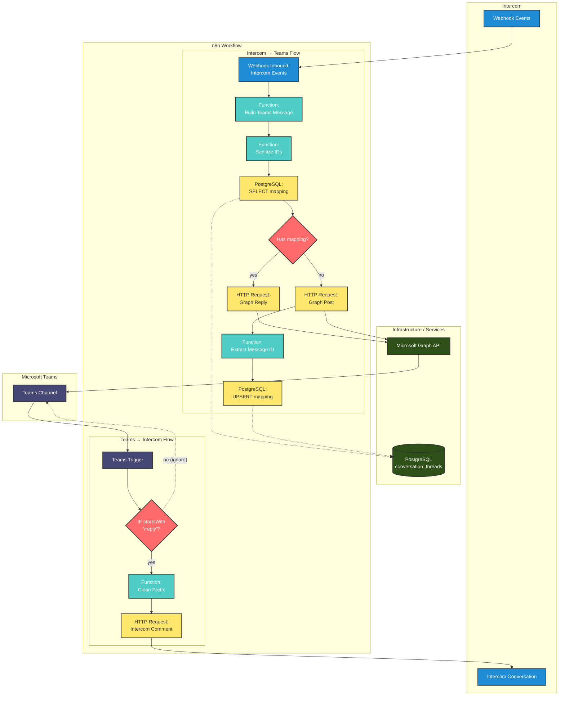

# Intercom ↔ Microsoft Teams Template (n8n)

Automate communication between [Microsoft Teams](https://www.microsoft.com/en-us/microsoft-teams) and [Intercom](https://www.intercom.com/) with a bidirectional flow ready for import into [n8n](https://github.com/n8n-io/n8n).

⏳ Estimated reading time: 12 min

## What this template does

MSTeams → Intercom flow (/reply command):

- [Microsoft Teams](https://www.microsoft.com/en-us/microsoft-teams) Trigger listens to messages in a specific channel.
- IF checks if the message starts with `/reply`.
- Function Clean Prefix removes the prefix and leaves only the response content.
- HTTP Request [Intercom](https://www.intercom.com/) sends a comment to the conversation in Intercom (with credential placeholders).

Intercom → MSTeams flow (webhook):

- Webhook (Inbound) receives events from [Intercom](https://www.intercom.com/) (configurable in your Intercom account).
- Build Teams Message normalizes the payload and builds a summary message.
- Lookup Thread Mapping ([PostgreSQL](https://www.postgresql.org/)) queries the `conversation_id → message_id` mapping in a PostgreSQL database.
- IF Has Mapping: if `message_id` exists, posts as a reply in the corresponding thread; otherwise, creates a new thread.
- Save Thread Mapping saves the newly created `message_id` for next time.

Note: the "false" path of the IF was fixed to not send messages that don't have the `/reply` prefix.

## Resources and processes diagram



Legend:

- Teams Trigger: listens to messages in the configured channel via env (`TEAMS_TRIGGER_CHANNEL_ID`).
- IF /reply: only messages starting with `/reply` proceed to [Intercom](https://www.intercom.com/).
- HTTP → Intercom: posts comment to conversation using `INTERCOM_API_TOKEN` and `INTERCOM_ADMIN_ID`.
- Webhook Inbound: receives events from [Intercom](https://www.intercom.com/) and starts the flow to Teams.
- [PostgreSQL](https://www.postgresql.org/): stores/queries the mapping `conversation_id ↔ message_id` (table `conversation_threads`).
- HTTP → Graph: creates post or thread reply in channel, authenticated via token/credential for [Microsoft Graph](https://docs.microsoft.com/en-us/graph/).

## Structure

- `workflow.json` — n8n workflow ready for import with all nodes and connections.
- `assets/` — optional for screenshots and diagrams.

## Placeholders you must fill

The workflow now uses environment variables (no need to edit the JSON):

- `TEAMS_TRIGGER_CHANNEL_ID` — channel monitored by [Microsoft Teams](https://www.microsoft.com/en-us/microsoft-teams) Trigger
- `TEAMS_TEAM_ID` — Team ID in [Microsoft Teams](https://www.microsoft.com/en-us/microsoft-teams) (Graph)
- `TEAMS_CHANNEL_ID` — Channel ID in [Microsoft Teams](https://www.microsoft.com/en-us/microsoft-teams) (Graph) for posting
- `MS_GRAPH_TOKEN` — [OAuth2](https://oauth.net/2/) access token for [Microsoft Graph](https://docs.microsoft.com/en-us/graph/)
- `INTERCOM_API_TOKEN` — [Intercom](https://www.intercom.com/) API token
- `INTERCOM_ADMIN_ID` — [Intercom](https://www.intercom.com/) admin ID
- `INTERCOM_WEBHOOK_SECRET` — optional; if set, the Intercom Webhook must send `x-hub-signature-256` and the flow validates the signature presence

Example file: `.env.example` (copy to `.env` and fill). The `db/init_db.sh` script loads `.env` automatically; in [n8n](https://github.com/n8n-io/n8n), define the same variables in the process environment ([Docker](https://www.docker.com/)/host env).

## Credentials and permissions

### [Microsoft Graph](https://docs.microsoft.com/en-us/graph/) (Teams)

1. Register application in [Azure AD](https://azure.microsoft.com/en-us/services/active-directory/)

   - [Azure Portal](https://portal.azure.com/) → [Microsoft Entra ID](https://www.microsoft.com/en-us/security/business/identity-access/microsoft-entra-id) → App registrations → New registration.
   - Note: Application (client) ID, Directory (tenant) ID.

2. Minimum suggested Graph permissions

   - `ChannelMessage.Send` (delegated or app-only) to post in channels.
   - `Team.ReadBasic.All` to resolve teams/channels as needed.
   - If using private chat/thread: consider `Chat.ReadWrite` (delegated) or RSC/app-only with resource scopes.

3. Secrets/Tokens

   - Create a Client Secret (Certificates & secrets) if using app-only with [Client Credentials](https://docs.microsoft.com/en-us/azure/active-directory/develop/v2-oauth2-client-creds-grant-flow).
   - If using Delegated flow ([OAuth2 Authorization Code](https://oauth.net/2/grant-types/authorization-code/)), create the [OAuth2](https://oauth.net/2/) credential in [n8n](https://github.com/n8n-io/n8n) (Credentials → OAuth2) pointing to [Microsoft Graph](https://docs.microsoft.com/en-us/graph/), and select this credential in the HTTP Request node (instead of manual Authorization header).
   - For quick tests, you can use a Bearer token in the `Authorization: Bearer YOUR_MS_GRAPH_TOKEN` header (not recommended for production).

### [Intercom](https://www.intercom.com/)

- [Intercom](https://www.intercom.com/) → [Developer Hub](https://developers.intercom.com/) → Create access token.
- Typical scopes: `write_conversations`, `read_conversations` (adjust according to your use).
- Note the token and the `admin_id` that will send comments.

## Compatibility

### Supported Versions

- **n8n**: >= 0.220.0
- **Node types version**: 1
- **PostgreSQL**: >= 12.0
- **Microsoft Graph API**: v1.0
- **Intercom API**: v2.0

### Node Dependencies

This template uses only native n8n nodes:

- `n8n-nodes-base.microsoftTeams.trigger`
- `n8n-nodes-base.if`
- `n8n-nodes-base.function`
- `n8n-nodes-base.httpRequest`
- `n8n-nodes-base.webhook`
- `n8n-nodes-base.postgres`

## Import workflow into n8n

1. Open your [n8n](https://github.com/n8n-io/n8n) → Workflows → Import.
2. Paste the content of `intercom-msteams-channel/workflow.json` and confirm.
3. No need to edit the JSON. Set environment variables and, in [n8n](https://github.com/n8n-io/n8n), select credentials ([PostgreSQL](https://www.postgresql.org/) and, optionally, [OAuth2](https://oauth.net/2/) for Graph) in the appropriate nodes when importing.
4. Activate the workflow. For the [Intercom](https://www.intercom.com/) Webhook Inbound, copy the URL generated by [n8n](https://github.com/n8n-io/n8n) (Production URL) and configure it in [Intercom](https://www.intercom.com/) (desired conversation events).

## Usage examples (/reply)

- In the monitored [Teams](https://www.microsoft.com/en-us/microsoft-teams) channel, send: `/reply The customer confirmed the appointment.`
- The flow will clean the prefix and send a comment to [Intercom](https://www.intercom.com/).
- When there's a new event in [Intercom](https://www.intercom.com/) (e.g., user/admin response), the Webhook triggers the flow and posts a summary in the [Teams](https://www.microsoft.com/en-us/microsoft-teams) channel.

## Test Payload Examples

### Intercom Payload (Webhook)

Example event received when a message is created in Intercom:

```json
{
  "type": "conversation.message.created",
  "data": {
    "item": {
      "id": "conv_123456789",
      "conversation_id": "conv_123456789",
      "body": "<p>Hello, I need help with my order #12345</p>",
      "author": {
        "type": "user",
        "name": "John Silva",
        "id": "user_abc123"
      },
      "conversation_message": {
        "body": "<p>Hello, I need help with my order #12345</p>"
      }
    }
  }
}
```

### Expected Output in Teams

Message that will be posted in the Microsoft Teams channel:

```text
Intercom (user: John Silva) [conv:conv_123456789]
Hello, I need help with my order #12345
```

### Teams Response Payload

Example message in Teams that will be sent to Intercom:

```text
Teams text: "/reply Your order #12345 has been processed successfully!"
```

### Expected Output in Intercom

Comment that will be added to the conversation in Intercom:

```json
{
  "message_type": "comment",
  "body": "Your order #12345 has been processed successfully!",
  "admin_id": "admin_xyz789"
}
```

## Message threading (included)

The template now tries to reply in the correct thread when possible:

- If mapping `conversation_id (Intercom) ↔ message_id (Teams)` already exists, uses `POST /v1.0/teams/{team-id}/channels/{channel-id}/messages/{message-id}/replies`.
- If mapping doesn't exist yet, creates a new thread with `POST /v1.0/teams/{team-id}/channels/{channel-id}/messages` and saves the returned `message_id` for future use.

How the mapping works (now in [PostgreSQL](https://www.postgresql.org/)):

- Table `conversation_threads` with columns: `intercom_conversation_id` (PK), `team_id`, `channel_id`, `teams_message_id`, timestamps.
- Lookup via SELECT searches for `teams_message_id` for an `intercom_conversation_id` + `team_id` + `channel_id`.
- When it doesn't exist, after creating a new thread in [Teams](https://www.microsoft.com/en-us/microsoft-teams), we do UPSERT to register the `teams_message_id`.

## PostgreSQL database

Files:

- `db/init.sql` — creates the `conversation_threads` table and updated_at trigger.
- `db/init_db.sh` — script to create the database (if it doesn't exist) and apply the schema.

Configuration and initialization:

1. Export environment variables (or pass inline):

```bash
export PGHOST=localhost
export PGPORT=5432
export PGUSER=postgres
export PGPASSWORD=secret
export DB_NAME=n8n_intercom
```

2. Run the script:

```bash
./intercom-msteams-channel/db/init_db.sh
```

3. In [n8n](https://github.com/n8n-io/n8n), create a [PostgreSQL](https://www.postgresql.org/) type credential with the same data (host, port, user, password, database). Assign this credential to the workflow's Postgres nodes (Lookup/Upsert).

DB-related placeholders in the workflow:

- The queries use `TEAMS_TEAM_ID` and `TEAMS_CHANNEL_ID` via environment variables to filter by team/channel.

## Best practices

- Don't commit/store tokens or secrets in the repository.
- Use [n8n](https://github.com/n8n-io/n8n) credentials ([OAuth2](https://oauth.net/2/)/Token) and environment variables.
- Least privilege possible in [Graph](https://docs.microsoft.com/en-us/graph/) and [Intercom](https://www.intercom.com/) permissions.
- Validate [Intercom](https://www.intercom.com/) Webhook payloads (signatures, if enabled).

### Compliance with n8n Template Submission Guidelines

This template was developed following the official n8n recommendations for template submission, as documented in: [Template submission guidelines](https://n8n.notion.site/Template-submission-guidelines-9959894476734da3b402c90b124b1f77)

| Guideline | Status | Description |
|-----------|--------|-------------|
| **File Structure** | ✅ **Implemented** | Template organized in its own directory with workflow.json, README.md and support files |
| **Valid JSON Format** | ✅ **Implemented** | workflow.json with valid JSON syntax and n8n-compatible structure |
| **Complete Metadata** | ✅ **Implemented** | Descriptive name, execution settings and proper versioning |
| **Unique Identifiers** | ✅ **Implemented** | Each node has a unique ID to avoid conflicts during import |
| **Native Nodes** | ✅ **Implemented** | Exclusive use of native n8n nodes (microsoftTeamsTrigger, webhook, code, httpRequest, postgres, if) |
| **Node Versions** | ✅ **Implemented** | Use of updated node versions (code v2, httpRequest v4.2, postgres v2.4) |
| **Error Handling** | ✅ **Implemented** | Implementation of error branches with onError: "continueErrorOutput" |
| **Environment Configuration** | ✅ **Implemented** | Use of environment variables (={{$env.VARIABLE}}) instead of hardcoded values |
| **Complete Documentation** | ✅ **Implemented** | Detailed README.md with installation, configuration and usage instructions |
| **Practical Examples** | ✅ **Implemented** | Payload examples, use cases and troubleshooting |
| **Node Positioning** | ✅ **Implemented** | Position coordinates defined for organized visual layout |
| **Structured Connections** | ✅ **Implemented** | Complete mapping of connections between nodes including error branches |
| **Security** | ✅ **Implemented** | HMAC validation, data sanitization and configured timeouts |
| **Compatibility** | ✅ **Implemented** | Specification of minimum compatible versions (n8n >= 0.220.0) |

## Error Handling and Robustness

This template includes several layers of protection against failures:

### Timeouts and Retry Logic

- **HTTP Requests**: Timeout of 10-15 seconds
- **Automatic retry**: Up to 3 attempts for Intercom, 2 for Teams
- **Data validation**: ID verification before processing

### Data Sanitization

- **SQL Injection Prevention**: Special character escaping
- **Size control**: 100 character limit for IDs
- **Control character removal**: Automatic cleaning of dangerous data

### Conditional Validations

- **/reply prefix**: Only valid messages are processed
- **Mapping verification**: Prevents thread duplication
- **Payload validation**: Verifies data structure received

### Error Routing and Fallbacks (new)

Dedicated error branches have been added with structured logs and fallback strategies:

- `Log Intercom Error` → `Fallback Intercom`: when Intercom call fails, the item is annotated with `_error`/`_fallback` fields for later reprocessing, queue or alert.
- `Log Graph Reply Error` → `Fallback Graph Reply`: if replying to thread fails, the annotation suggests trying as new post or notifying responsible party.
- `Log Graph Create Error` → `Fallback Graph Create`: if creating new message in channel fails, the item is marked for manual/automatic measures.

These fallbacks are neutral by default (don't automatically trigger new calls) and serve as extension points for integrations like queue, notification and reprocessing.

### Webhook Security (Intercom)

- Node `Validate Intercom HMAC`: when `INTERCOM_WEBHOOK_SECRET` is configured, the flow requires the `x-hub-signature-256` header. Absence of the header causes error and diverts to fallback path, avoiding processing unsigned events.
- Tip for complete cryptographic validation: add a `Crypto` node (native to n8n) before "Build Teams Message" to calculate HMAC SHA-256 of raw request body with `INTERCOM_WEBHOOK_SECRET` and compare with `x-hub-signature-256` header value.

## Troubleshooting

- Message doesn't post to [Teams](https://www.microsoft.com/en-us/microsoft-teams): check [Graph](https://docs.microsoft.com/en-us/graph/) permissions, token validity and team/channel IDs.
- [Intercom](https://www.intercom.com/) doesn't trigger Webhook: verify the public [n8n](https://github.com/n8n-io/n8n) URL (Production URL) and selected events.
- `/reply` doesn't trigger: confirm `YOUR_TEAMS_CHANNEL_ID` and that the message starts exactly with `/reply` (case-sensitive by default).
- **"Invalid conversation ID" error**: Verify that the Intercom payload contains a valid `id` or `conversation_id` field.
- **Request timeouts**: Check connectivity with Intercom and Microsoft Graph APIs.
- **Missing Intercom signature**: If you set `INTERCOM_WEBHOOK_SECRET`, enable signature in Intercom panel and confirm that the `x-hub-signature-256` header is reaching the n8n Webhook.

## Third-party solutions used

This template integrates the following third-party solutions and technologies:

- **[Microsoft Teams](https://www.microsoft.com/en-us/microsoft-teams)** - Microsoft's communication and collaboration platform
- **[Microsoft Graph API](https://docs.microsoft.com/en-us/graph/)** - Microsoft's unified API for accessing Microsoft 365 data and services
- **[Azure Active Directory / Microsoft Entra ID](https://www.microsoft.com/en-us/security/business/identity-access/microsoft-entra-id)** - Microsoft's identity and access management service
- **[Intercom](https://www.intercom.com/)** - Customer service and communication platform
- **[n8n](https://github.com/n8n-io/n8n)** - Open-source workflow automation platform
- **[PostgreSQL](https://www.postgresql.org/)** - Open-source relational database management system
- **[Docker](https://www.docker.com/)** - Containerization platform
- **[OAuth 2.0](https://oauth.net/2/)** - Authorization standard for APIs

## Disclaimer and responsibilities

⚠️ **IMPORTANT**: This template is provided "AS-IS" without any warranty, express or implied, including but not limited to warranties of fitness for a particular purpose, merchantability or non-infringement.

### Licenses and compliance

- The use of this template and integrated third-party technologies must respect **all licenses, terms of use and policies** of each mentioned solution
- It is the **user's responsibility** to verify and comply with the licensing terms of each technology used
- Consult the official documentation of each service to understand their limitations, costs and licensing requirements

### Limitation of liability

- The **author is not responsible** for any improper, inadequate use or non-compliance with the licenses of integrated technologies
- The **author does not provide support** for problems related to the use of third-party APIs, services or platforms
- Any **problem, interruption or limitation** in third-party services is outside the author's control and responsibility
- The **user assumes full responsibility** for the implementation, configuration and use of this solution

### Recommendations

- Always test in development environment before using in production
- Stay updated with changes in APIs and policies of used services
- Implement adequate monitoring and contingency plans
- Consult specialized professionals when necessary

## License

MIT (see `LICENSE` file).