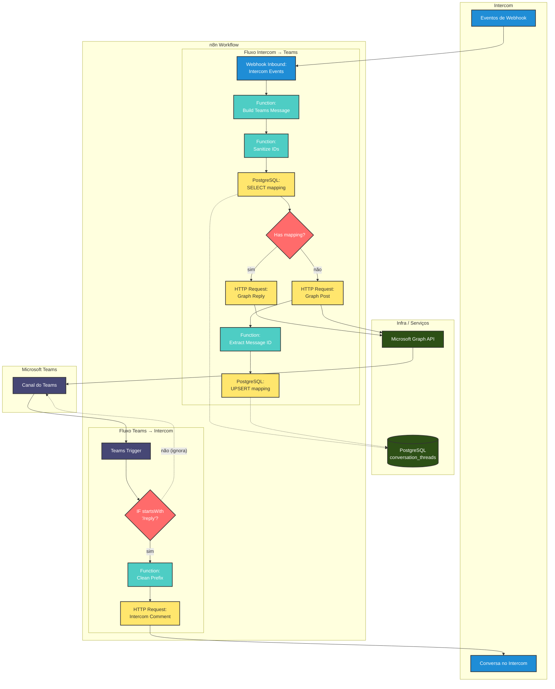

# Intercom ↔ Microsoft Teams Template (n8n)

Automatize a comunicação entre [Microsoft Teams](https://www.microsoft.com/pt-br/microsoft-teams) e [Intercom](https://www.intercom.com/) com um fluxo bidirecional pronto para importação no [n8n](https://github.com/n8n-io/n8n).

## O que este template faz


Fluxo MSTeams → Intercom (comando /reply):

- [Microsoft Teams](https://www.microsoft.com/pt-br/microsoft-teams) Trigger escuta mensagens em um canal específico.
- IF verifica se a mensagem começa com `/reply`.
- Function Clean Prefix remove o prefixo e deixa apenas o conteúdo da resposta.
- HTTP Request [Intercom](https://www.intercom.com/) envia um comentário para a conversa no Intercom (com placeholders de credenciais).

Fluxo Intercom → MSTeams (webhook):

- Webhook (Inbound) recebe eventos do [Intercom](https://www.intercom.com/) (configurável na sua conta Intercom).
- Build Teams Message normaliza o payload e monta uma mensagem de resumo.
- Lookup Thread Mapping ([PostgreSQL](https://www.postgresql.org/)) consulta o mapeamento `conversation_id → message_id` em um banco PostgreSQL.
- IF Has Mapping: se existir `message_id`, publica como resposta no tópico correspondente; caso contrário, cria um novo tópico.
- Save Thread Mapping salva o `message_id` recém-criado para a próxima vez.

Observação: o caminho “false” do IF foi corrigido para não enviar mensagens que não tenham o prefixo `/reply`.

## Diagrama de recursos e processos



Legenda:

- Teams Trigger: escuta mensagens no canal configurado via env (`TEAMS_TRIGGER_CHANNEL_ID`).
- IF /reply: somente mensagens começando com `/reply` seguem para o [Intercom](https://www.intercom.com/).
- HTTP → Intercom: publica comentário na conversa usando `INTERCOM_API_TOKEN` e `INTERCOM_ADMIN_ID`.
- Webhook Inbound: recebe eventos do [Intercom](https://www.intercom.com/) e inicia o fluxo para o Teams.
- [PostgreSQL](https://www.postgresql.org/): guarda/consulta o mapeamento `conversation_id ↔ message_id` (tabela `conversation_threads`).
- HTTP → Graph: cria post ou resposta em thread no canal, autenticado via token/credencial do [Microsoft Graph](https://docs.microsoft.com/pt-br/graph/).

## Estrutura

- `workflow.json` — workflow do n8n pronto para importação com todos os nodes e conexões.
- `assets/` — opcional para capturas de tela e diagramas.

## Placeholders que você deve preencher

Agora o workflow usa variáveis de ambiente (sem precisar editar o JSON):

- `TEAMS_TRIGGER_CHANNEL_ID` — canal monitorado pelo [Microsoft Teams](https://www.microsoft.com/pt-br/microsoft-teams) Trigger
- `TEAMS_TEAM_ID` — ID do time no [Microsoft Teams](https://www.microsoft.com/pt-br/microsoft-teams) (Graph)
- `TEAMS_CHANNEL_ID` — ID do canal no [Microsoft Teams](https://www.microsoft.com/pt-br/microsoft-teams) (Graph) para publicar
- `MS_GRAPH_TOKEN` — token [OAuth2](https://oauth.net/2/) de acesso ao [Microsoft Graph](https://docs.microsoft.com/pt-br/graph/)
- `INTERCOM_API_TOKEN` — token de API do [Intercom](https://www.intercom.com/)
- `INTERCOM_ADMIN_ID` — ID do admin do [Intercom](https://www.intercom.com/)
- `INTERCOM_WEBHOOK_SECRET` — opcional; se definido, o Webhook do Intercom deve enviar `x-hub-signature-256` e o fluxo valida a presença da assinatura

Arquivo de exemplo: `.env.example` (copie para `.env` e preencha). O script `db/init_db.sh` carrega `.env` automaticamente; no [n8n](https://github.com/n8n-io/n8n), defina as mesmas variáveis no ambiente do processo ([Docker](https://www.docker.com/)/env do host).

## Credenciais e permissões

### [Microsoft Graph](https://docs.microsoft.com/pt-br/graph/) (Teams)

1. Registrar aplicativo no [Azure AD](https://azure.microsoft.com/pt-br/services/active-directory/)

   - [Azure Portal](https://portal.azure.com/) → [Microsoft Entra ID](https://www.microsoft.com/pt-br/security/business/identity-access/microsoft-entra-id) → Registros de aplicativos → Novo registro.
   - Anote: Application (client) ID, Directory (tenant) ID.

2. Permissões Graph mínimas sugeridas

   - `ChannelMessage.Send` (delegada ou app-only) para postar em canais.
   - `Team.ReadBasic.All` para resolver times/canais conforme necessário.
   - Se for usar chat privado/thread: avalie `Chat.ReadWrite` (delegada) ou RSC/app-only com escopos por recurso.

3. Segredo/Tokens

   - Crie um Client Secret (Certificados e segredos) se for usar app-only com [Client Credentials](https://docs.microsoft.com/pt-br/azure/active-directory/develop/v2-oauth2-client-creds-grant-flow).
   - Se usar fluxo Delegated ([OAuth2 Authorization Code](https://oauth.net/2/grant-types/authorization-code/)), crie a credencial [OAuth2](https://oauth.net/2/) no [n8n](https://github.com/n8n-io/n8n) (Credenciais → OAuth2) apontando para [Microsoft Graph](https://docs.microsoft.com/pt-br/graph/), e selecione essa credencial no node HTTP Request (em vez de header Authorization manual).
   - Para testes rápidos, você pode usar um token de Bearer no header `Authorization: Bearer YOUR_MS_GRAPH_TOKEN` (não recomendado em produção).

### [Intercom](https://www.intercom.com/)

- [Intercom](https://www.intercom.com/) → [Developer Hub](https://developers.intercom.com/) → Create access token.
- Escopos típicos: `write_conversations`, `read_conversations` (ajuste conforme seu uso).
- Anote o token e o `admin_id` que enviará comentários.

## Compatibilidade

### Versões Suportadas

- **n8n**: >= 0.220.0
- **Node types version**: 1
- **PostgreSQL**: >= 12.0
- **Microsoft Graph API**: v1.0
- **Intercom API**: v2.0

### Dependências de Nodes

Este template utiliza apenas nodes nativos do n8n:

- `n8n-nodes-base.microsoftTeams.trigger`
- `n8n-nodes-base.if`
- `n8n-nodes-base.function`
- `n8n-nodes-base.httpRequest`
- `n8n-nodes-base.webhook`
- `n8n-nodes-base.postgres`

## Importar o workflow no n8n

1. Abra seu [n8n](https://github.com/n8n-io/n8n) → Workflows → Import.
2. Cole o conteúdo de `intercom-msteams-channel/workflow.json` e confirme.
3. Não é necessário editar o JSON. Defina as variáveis de ambiente e, no [n8n](https://github.com/n8n-io/n8n), selecione credenciais ([PostgreSQL](https://www.postgresql.org/) e, opcionalmente, [OAuth2](https://oauth.net/2/) do Graph) nos nodes apropriados quando importar.
4. Ative o workflow. Para o Webhook Inbound do [Intercom](https://www.intercom.com/), copie a URL gerada pelo [n8n](https://github.com/n8n-io/n8n) (Production URL) e configure no [Intercom](https://www.intercom.com/) (eventos de conversa desejados).

## Exemplo de uso (/reply)

- No canal do [Teams](https://www.microsoft.com/pt-br/microsoft-teams) monitorado, envie: `/reply O cliente confirmou o horário.`
- O fluxo limpará o prefixo e enviará um comentário ao [Intercom](https://www.intercom.com/).
- Quando houver um novo evento no [Intercom](https://www.intercom.com/) (ex.: resposta do usuário/admin), o Webhook aciona o fluxo e publica um resumo no canal do [Teams](https://www.microsoft.com/pt-br/microsoft-teams).

## Exemplos de Payloads de Teste

### Payload do Intercom (Webhook)

Exemplo de evento recebido quando uma mensagem é criada no Intercom:

```json
{
  "type": "conversation.message.created",
  "data": {
    "item": {
      "id": "conv_123456789",
      "conversation_id": "conv_123456789",
      "body": "<p>Olá, preciso de ajuda com meu pedido #12345</p>",
      "author": {
        "type": "user",
        "name": "João Silva",
        "id": "user_abc123"
      },
      "conversation_message": {
        "body": "<p>Olá, preciso de ajuda com meu pedido #12345</p>"
      }
    }
  }
}
```

### Output Esperado no Teams

Mensagem que será publicada no canal do Microsoft Teams:

```text
Intercom (user: João Silva) [conv:conv_123456789]
Olá, preciso de ajuda com meu pedido #12345
```

### Payload de Resposta do Teams

Exemplo de mensagem no Teams que será enviada ao Intercom:

```text
Texto no Teams: "/reply Seu pedido #12345 foi processado com sucesso!"
```

### Output Esperado no Intercom

Comentário que será adicionado à conversa no Intercom:

```json
{
  "message_type": "comment",
  "body": "Seu pedido #12345 foi processado com sucesso!",
  "admin_id": "admin_xyz789"
}
```

## Encadeamento de mensagens (incluído)

Agora o template tenta responder no tópico correto quando possível:

- Se já existir mapeamento `conversation_id (Intercom) ↔ message_id (Teams)`, usa `POST /v1.0/teams/{team-id}/channels/{channel-id}/messages/{message-id}/replies`.
- Se ainda não existir mapeamento, cria um novo tópico com `POST /v1.0/teams/{team-id}/channels/{channel-id}/messages` e salva o `message_id` retornado para uso futuro.

Como funciona o mapeamento (agora em [PostgreSQL](https://www.postgresql.org/)):

- Tabela `conversation_threads` com as colunas: `intercom_conversation_id` (PK), `team_id`, `channel_id`, `teams_message_id`, timestamps.
- Lookup via SELECT busca `teams_message_id` para um `intercom_conversation_id` + `team_id` + `channel_id`.
- Quando não existir, ao criar um novo tópico no [Teams](https://www.microsoft.com/pt-br/microsoft-teams), fazemos UPSERT para registrar o `teams_message_id`.

## Banco de dados [PostgreSQL](https://www.postgresql.org/)

Arquivos:

- `db/init.sql` — cria a tabela `conversation_threads` e trigger de updated_at.
- `db/init_db.sh` — script para criar o banco (se não existir) e aplicar o schema.

Configuração e inicialização:

1. Exportar variáveis de ambiente (ou passar inline):

```bash
export PGHOST=localhost
export PGPORT=5432
export PGUSER=postgres
export PGPASSWORD=secret
export DB_NAME=n8n_intercom
```

1. Rodar o script:

```bash
./intercom-msteams-channel/db/init_db.sh
```

1. No [n8n](https://github.com/n8n-io/n8n), crie uma credencial do tipo [PostgreSQL](https://www.postgresql.org/) com os mesmos dados (host, porta, usuário, senha, database). Atribua essa credencial aos nodes Postgres do workflow (Lookup/Upsert).

Placeholders relacionados ao DB no workflow:

- As queries usam `TEAMS_TEAM_ID` e `TEAMS_CHANNEL_ID` via variáveis de ambiente para filtrar por time/canal.

## Boas práticas

- Não commit/armazenar tokens ou segredos no repositório.
- Usar credenciais do [n8n](https://github.com/n8n-io/n8n) ([OAuth2](https://oauth.net/2/)/Token) e variáveis de ambiente.
- Menor privilégio possível nas permissões do [Graph](https://docs.microsoft.com/pt-br/graph/) e [Intercom](https://www.intercom.com/).
- Validar payloads do Webhook do [Intercom](https://www.intercom.com/) (assinaturas, se habilitadas).

### Conformidade com Diretrizes de Submissão de Templates n8n

Este template foi desenvolvido seguindo as recomendações oficiais da n8n para submissão de templates, conforme documentado em: [Template submission guidelines](https://n8n.notion.site/Template-submission-guidelines-9959894476734da3b402c90b124b1f77)

| Diretriz | Status | Descrição |
|----------|--------|-----------|
| **Estrutura de Arquivo** | ✅ **Implementado** | Template organizado em diretório próprio com workflow.json, README.md e arquivos de suporte |
| **Formato JSON Válido** | ✅ **Implementado** | workflow.json com sintaxe JSON válida e estrutura compatível com n8n |
| **Metadados Completos** | ✅ **Implementado** | Nome descritivo, configurações de execução e versionamento adequado |
| **Identificadores Únicos** | ✅ **Implementado** | Cada node possui ID único para evitar conflitos na importação |
| **Nodes Nativos** | ✅ **Implementado** | Uso exclusivo de nodes nativos do n8n (microsoftTeamsTrigger, webhook, code, httpRequest, postgres, if) |
| **Versões de Nodes** | ✅ **Implementado** | Uso de versões atualizadas dos nodes (code v2, httpRequest v4.2, postgres v2.4) |
| **Tratamento de Erros** | ✅ **Implementado** | Implementação de ramos de erro com onError: "continueErrorOutput" |
| **Configuração por Ambiente** | ✅ **Implementado** | Uso de variáveis de ambiente (={{$env.VARIABLE}}) ao invés de valores hardcoded |
| **Documentação Completa** | ✅ **Implementado** | README.md detalhado com instruções de instalação, configuração e uso |
| **Exemplos Práticos** | ✅ **Implementado** | Payloads de exemplo, casos de uso e troubleshooting |
| **Posicionamento de Nodes** | ✅ **Implementado** | Coordenadas de posição definidas para layout visual organizado |
| **Conexões Estruturadas** | ✅ **Implementado** | Mapeamento completo de conexões entre nodes incluindo ramos de erro |
| **Segurança** | ✅ **Implementado** | Validação HMAC, sanitização de dados e timeouts configurados |
| **Compatibilidade** | ✅ **Implementado** | Especificação de versões mínimas compatíveis (n8n >= 0.220.0) |

## Tratamento de Erros e Robustez

Este template inclui várias camadas de proteção contra falhas:

### Timeouts e Retry Logic

- **HTTP Requests**: Timeout de 10-15 segundos
- **Retry automático**: Até 3 tentativas para Intercom, 2 para Teams
- **Validação de dados**: Verificação de IDs antes do processamento

### Sanitização de Dados

- **SQL Injection Prevention**: Escape de caracteres especiais
- **Controle de tamanho**: Limitação de 100 caracteres para IDs
- **Remoção de caracteres de controle**: Limpeza automática de dados perigosos

### Validações Condicionais

- **Prefixo /reply**: Apenas mensagens válidas são processadas
- **Verificação de mapeamento**: Evita duplicação de threads
- **Validation de payloads**: Verifica estrutura dos dados recebidos

### Roteamento de Erros e Fallbacks (novos)

Foram adicionados ramos de erro dedicados com logs estruturados e estratégias de fallback:

- `Log Intercom Error` → `Fallback Intercom`: quando a chamada ao Intercom falhar, o item é anotado com campos `_error`/`_fallback` para posterior reprocessamento, fila ou alerta.
- `Log Graph Reply Error` → `Fallback Graph Reply`: se responder na thread falhar, a anotação sugere tentar como novo post ou notificar responsável.
- `Log Graph Create Error` → `Fallback Graph Create`: se criar mensagem nova no canal falhar, o item é marcado para medidas manuais/automáticas.

Esses fallbacks são neutros por padrão (não disparam novas chamadas automaticamente) e servem como pontos de extensão para integrações como fila, notificação e reprocessamento.

### Segurança do Webhook (Intercom)

- Node `Validate Intercom HMAC`: quando `INTERCOM_WEBHOOK_SECRET` estiver configurado, o fluxo exige o cabeçalho `x-hub-signature-256`. A ausência do cabeçalho provoca erro e desvia para o caminho de fallback, evitando processar eventos não assinados.
- Dica para validação criptográfica completa: adicione um node `Crypto` (nativo do n8n) antes de "Build Teams Message" para calcular HMAC SHA-256 do corpo bruto do request com o `INTERCOM_WEBHOOK_SECRET` e compare com o valor do cabeçalho `x-hub-signature-256`.

## Solução de problemas

- Mensagem não publica no [Teams](https://www.microsoft.com/pt-br/microsoft-teams): verifique permissões do [Graph](https://docs.microsoft.com/pt-br/graph/), validade do token e IDs de team/channel.
- [Intercom](https://www.intercom.com/) não aciona Webhook: confira a URL pública do [n8n](https://github.com/n8n-io/n8n) (Production URL) e eventos selecionados.
- `/reply` não dispara: confirme `YOUR_TEAMS_CHANNEL_ID` e que a mensagem inicia exatamente com `/reply` (case-sensitive por padrão).
- **Erro "Invalid conversation ID"**: Verifique se o payload do Intercom contém o campo `id` ou `conversation_id` válido.
- **Timeout em requests**: Verifique conectividade com APIs do Intercom e Microsoft Graph.
- **Assinatura do Intercom ausente**: Se você definiu `INTERCOM_WEBHOOK_SECRET`, habilite a assinatura no painel do Intercom e confirme que o header `x-hub-signature-256` está chegando no Webhook do n8n.

## Soluções de terceiros utilizadas

Este template integra as seguintes soluções e tecnologias de terceiros:

- **[Microsoft Teams](https://www.microsoft.com/pt-br/microsoft-teams)** - Plataforma de comunicação e colaboração da Microsoft
- **[Microsoft Graph API](https://docs.microsoft.com/pt-br/graph/)** - API unificada da Microsoft para acessar dados e serviços do Microsoft 365
- **[Azure Active Directory / Microsoft Entra ID](https://www.microsoft.com/pt-br/security/business/identity-access/microsoft-entra-id)** - Serviço de identidade e gerenciamento de acesso da Microsoft
- **[Intercom](https://www.intercom.com/)** - Plataforma de atendimento ao cliente e comunicação
- **[n8n](https://github.com/n8n-io/n8n)** - Plataforma de automação de workflows open-source
- **[PostgreSQL](https://www.postgresql.org/)** - Sistema de gerenciamento de banco de dados relacional open-source
- **[Docker](https://www.docker.com/)** - Plataforma de containerização
- **[OAuth 2.0](https://oauth.net/2/)** - Padrão de autorização para APIs

## Disclaimer e responsabilidades

⚠️ **IMPORTANTE**: Este template é fornecido "AS-IS" (como está) sem qualquer tipo de garantia, expressa ou implícita, incluindo mas não limitada a garantias de adequação para um propósito específico, comercialização ou não violação de direitos.

### Licenças e conformidade

- O uso deste template e das tecnologias de terceiros integradas deve respeitar **todas as licenças, termos de uso e políticas** de cada solução mencionada
- É de **responsabilidade do usuário** verificar e cumprir os termos de licenciamento de cada tecnologia utilizada
- Consulte a documentação oficial de cada serviço para entender suas limitações, custos e requisitos de licenciamento

### Limitações de responsabilidade

- O **autor não se responsabiliza** por qualquer uso indevido, inadequado ou em desconformidade com as licenças das tecnologias integradas
- O **autor não oferece suporte** para problemas relacionados ao uso das APIs, serviços ou plataformas de terceiros
- Qualquer **problema, interrupção ou limitação** nos serviços de terceiros está fora do controle e responsabilidade do autor
- O **usuário assume total responsabilidade** pela implementação, configuração e uso desta solução

### Recomendações

- Teste sempre em ambiente de desenvolvimento antes de usar em produção
- Mantenha-se atualizado com as mudanças nas APIs e políticas dos serviços utilizados
- Implemente monitoramento adequado e planos de contingência
- Consulte profissionais especializados quando necessário

## Licença

MIT (ver arquivo `LICENSE`).
